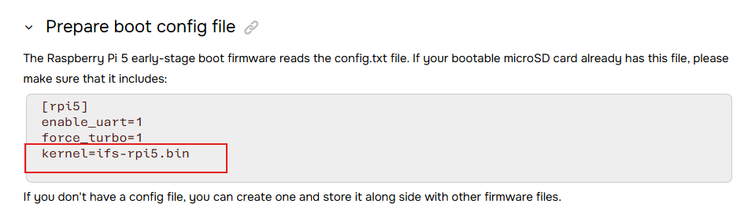

# QNX BSP for Raspberry Pi 5 (BCM2712) - 代码分析

## 仓库概述

QNX 8.0 BSP (Board Support Package)，目标平台为 Raspberry Pi 5 (BCM2712 SoC)，由 BlackBerry/QNX 开发。整个仓库用 C 和 AArch64 汇编编写，面向 QNX Neutrino RTOS。

## 目录结构

```
├── Makefile              # 顶层构建入口
├── images/
│   └── rpi5.build        # QNX IFS 镜像构建脚本（系统启动脚本+文件布局）
├── src/hardware/
│   ├── startup/          # ★ 系统启动程序 (startup-bcm2712-rpi5)
│   │   ├── lib/          # startup 通用库（_start.S → cstart.S → _main.c）
│   │   └── boards/bcm/bcm2712/  # BCM2712 板级 main.c
│   ├── devc/serpl011/    # ★ 串口驱动 (devc-serpl011-rpi5)
│   ├── devb/sdmmc/       # ★ SD/eMMC 块设备驱动 (devb-sdmmc-bcm2712)
│   ├── i2c/dwc/          # ★ I2C 驱动 (i2c-dwc-rpi5)
│   ├── spi/dwc/          # ★ SPI 驱动 (spi-dwc)
│   └── support/
│       ├── bcm2712/fan/      # ★ 风扇 PWM 控制 (fan-rpi5)
│       ├── bcm2712/gpio-*/   # GPIO 工具 (gpio-rp1, gpio-bcm, gpio-aon-bcm)
│       ├── bcm2712/mbox/     # ★ Mailbox 工具 (mbox-bcm)
│       ├── bcm2712/msix-rp1/ # ★ MSI-X 中断配置 (msix-rp1)
│       └── wdtkick/          # ★ 看门狗 (wdtkick)
```

## 启动流程

### 1. 系统引导入口 — startup-bcm2712-rpi5

从裸机状态初始化到 QNX microkernel (procnto) 的完整链路：

```
_start (汇编)
  └─→ cstart (汇编: 设置栈、禁中断、刷 cache)
        └─→ _main() (C: 核心初始化框架)
              ├── board_init()           # 板级早期初始化
              ├── setup_cmdline()        # 解析启动参数
              ├── cpu_startup()          # CPU 架构初始化
              ├── init_syspage_memory()  # 分配 syspage
              └─→ main()                # ★ 板级 main (BCM2712 特定)
                    ├── select_debug()           # PL011 串口调试输出
                    ├── handle_common_option()   # 解析 -W 等参数
                    ├── bcm2712_wdt_enable()     # 可选：使能看门狗
                    ├── mbox_get_clock_rate()    # 通过 Mailbox 获取 CPU 频率
                    ├── bcm2712_init_raminfo()   # 内存信息初始化
                    ├── fdt_psci_configure()     # FDT → PSCI 配置
                    ├── hypervisor_init()        # Hypervisor 初始化
                    ├── init_smp()               # 多核 SMP 启动
                    ├── init_mmu()               # MMU 页表建立
                    ├── init_pcie_ext_msi_controller() # PCIe MSI 中断控制器
                    ├── init_intrinfo()          # 中断信息 (GIC v2/v3)
                    ├── init_qtime()             # 系统时钟
                    ├── init_cacheattr()         # Cache 属性
                    ├── init_cpuinfo()           # CPU 信息
                    ├── init_hwinfo()            # 硬件信息注册到 syspage
                    ├── init_gpio_aon_bcm()      # AON GPIO 初始化
                    └── init_system_private()    # 加载 IFS 中的 bootstrap 程序
              ├── write_syspage_memory()  # 写入最终 syspage
              ├── smp_hook_rtn()          # 通知 AP 核 syspage 就绪
              └── startnext()             # 跳转到 procnto 内核
```

关键文件：

| 文件 | 说明 |
|------|------|
| `src/hardware/startup/lib/aarch64/_start.S:56` | 汇编最初入口 |
| `src/hardware/startup/lib/aarch64/cstart.S:74` | 栈初始化，跳转 `_main` |
| `src/hardware/startup/lib/_main.c:124` | `_main()` 框架函数 |
| `src/hardware/startup/boards/bcm/bcm2712/main.c:116` | 板级 `main()` |

### 2. IFS 启动脚本 — images/rpi5.build

`startup-bcm2712-rpi5` 完成后，procnto 内核启动，按 `rpi5.build` 中的 startup-script 顺序执行：

```
startup-bcm2712-rpi5 → procnto-smp-instr
  └─→ startup-script:
        ├── slogger2, dumper, mqueue, random       # 基础服务
        ├── wdtkick                                # 看门狗喂狗
        ├── pci-server + msix-rp1                  # PCIe + RP1 MSI-X 中断
        ├── devc-serpl011-rpi5                     # 串口驱动
        ├── gpio-rp1 + spi-dwc                     # GPIO/SPI
        ├── devb-sdmmc-bcm2712                     # SD 卡驱动
        ├── io-usb-otg                             # USB
        ├── io-sock + dhcpcd                       # 网络
        ├── sshd, qconn                            # 远程调试
        ├── i2c-dwc-rpi5                           # I2C
        ├── fan-rpi5                               # 风扇控制
        └── ksh                                    # 用户 shell
```

### 3. 各驱动入口函数

| 组件 | 入口函数 | 文件 |
|------|---------|------|
| **串口驱动** | `main()` → `options()` → `ttc(TTC_INIT_START)` | `devc/serpl011/main.c:46` |
| **SD/eMMC 驱动** | `sim_bs_init()` (SIM 模块注册) | `devb/sdmmc/aarch64/bcm2712.le/sim_bs.c` |
| **I2C 驱动** | `init()` → `probe()` → `sendrecv()` | `i2c/dwc/init.c`, `probe.c`, `sendrecv.c` |
| **SPI 驱动** | `init()` → `xfer()` | `spi/dwc/init.c`, `xfer.c` |
| **风扇控制** | `main()` → `pwm_fan_init()` → `resmgr_init()` → `resmgr_loop_start()` | `support/bcm2712/fan/main.c:69` |
| **MSI-X 配置** | `main()` → PCI attach → `rp1_pcie_msix_cfg()` → `bcm2712_mip_intc_cfg()` | `support/bcm2712/msix-rp1/main.c:274` |
| **看门狗** | `main()` → `wd_parse_hwinfo()` → `wd_parse_options()` → 循环 `write_wdt()` | `support/wdtkick/main.c:672` |
| **GPIO 工具** | `main()` → 直接操作 GPIO 寄存器 | `support/bcm2712/gpio-*/gpio.c` |
| **Mailbox 工具** | `main()` → VideoCore mailbox 通信 | `support/bcm2712/mbox/mbox.c` |

## 总体调用流程图

```
[硬件上电]
    │
    ▼
_start.S (AArch64 汇编，保存 boot regs)
    │
    ▼
cstart.S (禁中断, 设置栈, 刷 cache)
    │
    ▼
_main() (C 框架: board_init → setup_cmdline → cpu_startup → syspage)
    │
    ▼
main() [BCM2712 板级] (PL011调试口, RAM, PSCI, SMP, MMU, GIC, PCIe, HWinfo)
    │
    ▼
init_system_private() → write_syspage → startnext()
    │
    ▼
procnto-smp-instr (QNX 微内核)
    │
    ▼
startup-script (按顺序启动各驱动和服务)
    │
    ├── wdtkick (看门狗喂狗守护进程)
    ├── pci-server + msix-rp1 (PCIe 总线 + RP1 中断)
    ├── devc-serpl011-rpi5 (串口)
    ├── spi-dwc (SPI)
    ├── devb-sdmmc-bcm2712 (SD卡)
    ├── io-usb-otg (USB)
    ├── io-sock + dhcpcd (网络)
    ├── i2c-dwc-rpi5 (I2C)
    ├── fan-rpi5 (风扇)
    └── ksh (用户 shell)
```

## 编译及使用
- bash build.sh后会在images目录生成ifs-rpi5.bin
- 然后参考文档https://www.qnx.com/developers/docs/BSP8.0/com.qnx.doc.bsp_raspberrypi.bcm2712.rpi5_8.0/topic/install_notes.html进行安装
- 修改config.txt使用qnx ifs启动
- 

### 详细设置
- https://www.qnx.com/developers/docs/BSP8.0/com.qnx.doc.bsp_raspberrypi.bcm2712.rpi5_8.0/topic/bsp_transfer_overview.html
- https://www.qnx.com/developers/docs/BSP8.0/com.qnx.doc.bsp_raspberrypi.bcm2712.rpi5_8.0/topic/bsp_transfer.html

